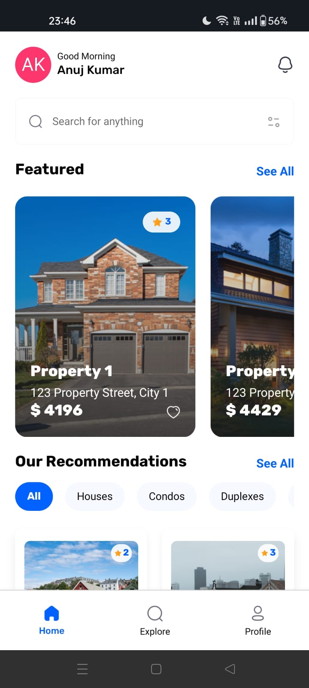
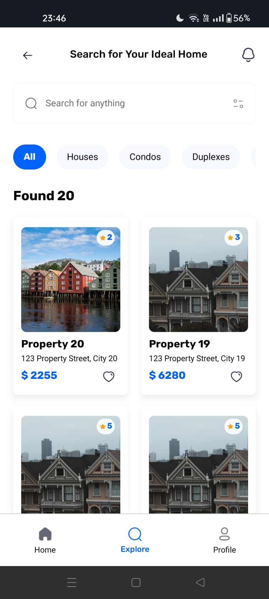

# Real Estate Mobile Application

A modern and intuitive mobile application for real estate listings, built with React Native and Expo.

## Overview

This real estate application provides a seamless experience for users to browse, search, and explore property listings. With features like real-time search, property filtering, and detailed property information, users can easily find their ideal home.

## Key Features

- **Advanced Property Search**: Real-time search functionality with filters
- **Property Categories**: Browse properties by type (Houses, Condos, Duplexes)
- **User Authentication**: Secure Google OAuth integration
- **Property Details**: Comprehensive property information including amenities
- **Responsive Design**: Optimized for both iOS and Android platforms
- **Favorites**: Save and track preferred properties
- **User Profiles**: Personalized user experience with saved preferences

## Screenshots

<div align="center">
  
  
  
  
</div>

## Technical Stack

### Frontend

- React Native
- Expo Router for navigation
- NativeWind (TailwindCSS) for styling
- TypeScript for type safety

### Backend Services

- Appwrite for authentication and database
- Real-time data synchronization
- Secure API integration

### Development Tools

- Expo CLI
- TypeScript
- ESLint & Prettier
- Git for version control

## Installation

1. Clone the repository

```bash
git clone https://github.com/anuj846k/React_Native_demo_app.git
cd React_Native_demo_app
```

2. Install dependencies

```bash
npm install
```

3. Configure environment variables

```bash
EXPO_PUBLIC_APPWRITE_ENDPOINT=your_endpoint
EXPO_PUBLIC_APPWRITE_PROJECT_ID=your_project_id
EXPO_PUBLIC_APPWRITE_DATABASE_ID=your_database_id
```

4. Start the development server

```bash
npx expo start
```

## Project Structure

```
├── app/                  # Main application code
│   ├── (root)            # Root navigation
│   │   ├── (tabs)        # Tab navigation
│   │   └── (properties)       # Properties navigation
│   │       
├── assets/              # Static assets
├── components/          # Reusable components
├── constants/           # App constants
├── lib/                 # Utilities and services
```

## Performance Features

- Optimized image loading and caching
- Efficient state management with Context API
- Debounced search functionality
- Lazy loading of components
- Minimized re-renders using React hooks

## Security Features

- Secure OAuth2 authentication
- Environment variable protection
- API request encryption
- Secure data storage

## Development Practices

- Clean and maintainable code architecture
- Component-based development
- TypeScript for enhanced development experience
- Regular code reviews and testing

## Contact

For business inquiries and collaboration:

- Email: anuj846k@gmail.com
- LinkedIn: https://www.linkedin.com/in/anuj-kumar-6aa13b264/
- Portfolio: https://www.anuj846k.tech/about

## License

This project is licensed under the MIT License - see the LICENSE file for details.
